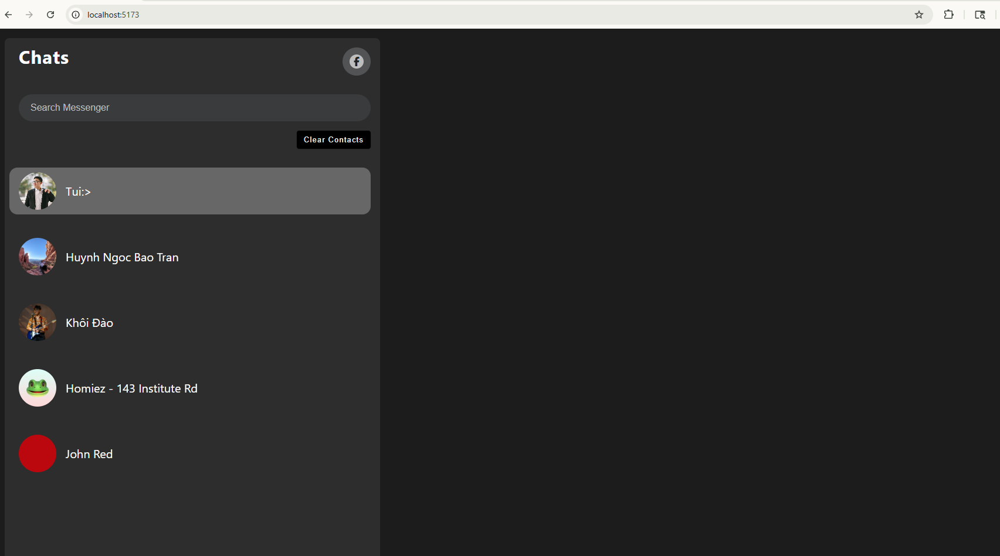

## Model
Goal: Cloning the layout of Messenger

## Steps

### Import Data
Update README with the final goal and prepare the profiles' images in src/assets. Then prepare data in data.js

### Set Up Basic Layout
This is the current layout 

### Setup State Variable

### Iterate and Render

### Clear List
